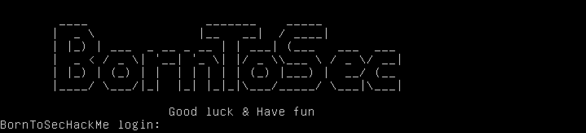

<h1 align="center">
Boot2Root 
</h1>

<h3 align="center"><b>Description</b></h3>

Challenge Securité : Cherchez en groupe les différents moyens de passer root sur l'ISO fournie en ressources.

<b>Objectif : </b>Réussir en groupe de 4 étudiants, à passer root sur l'ISO fournie en ressources et rendre les solutions trouvée dans des fichiers "writeup".

<b>Solutions : </b>

 * [Writeup1](writeup1.md): La solution du jeu de piste prévue dans le projet

 * [Writeup2](writeup2.md): Utilisation de l'exploit [dirtycow](https://dirtycow.ninja/)

 * [Writeup3](bonus/writeup3.md): Lancement d'un terminal au boot du serveur

 

||<h3 align="center"> Documentation </h3>|
|:--------:|:---------:|
|Linux Privilege Escalation|https://payatu.com/guide-linux-privilege-escalation|
|Return-to-libc|https://www.exploit-db.com/docs/english/28553-linux-classic-return-to-libc-&-return-to-libc-chaining-tutorial.pdf  [En Français:]https://beta.hackndo.com/retour-a-la-libc/|
|Sécurité des systèmes informatiques   Escalade des privilèges|http://nicolas.baudru.perso.luminy.univ-amu.fr/Ressources/SSI_securiteEdP.pdf|
|||
|||

----

Credits  <a href="https://github.com/lpieri">cpieri</a>  <a href="https://github.com/serronia">jdarko</a>  <a href="https://github.com/leonardogb">lgarcia-</a>  <a href="https://github.com/Drakauf">shthevak</a>
