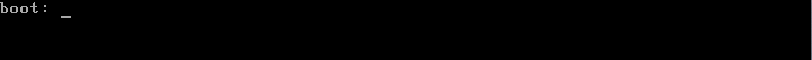
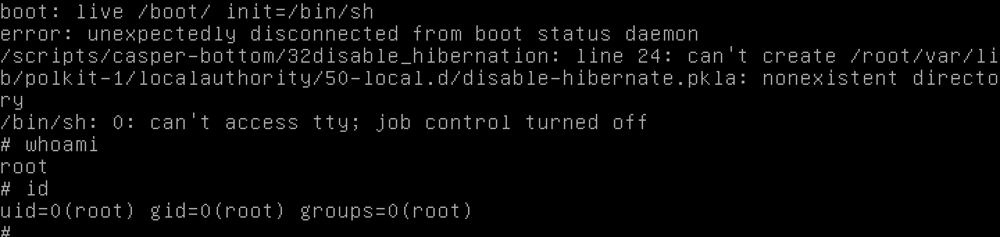

# Writeup numéro 3

## Changement du script de démarrage:

Au lancement de la virtual machine, nous pouvons choisir comment la vm va booter.

Pour cela au lancement de la vm nous pouvons appuyer simultanement sur les touches `control` + `alt` + `F1` et la vm va alors nous demander la méthode pour booter.

A ce moment la il ne nous reste plus qu'à ecrire que nous voulons booter la vm avec comme paramètre `init`, le script de démarage égal à `init=/bin/sh`

## TOUDOM nous voilà root !!!
